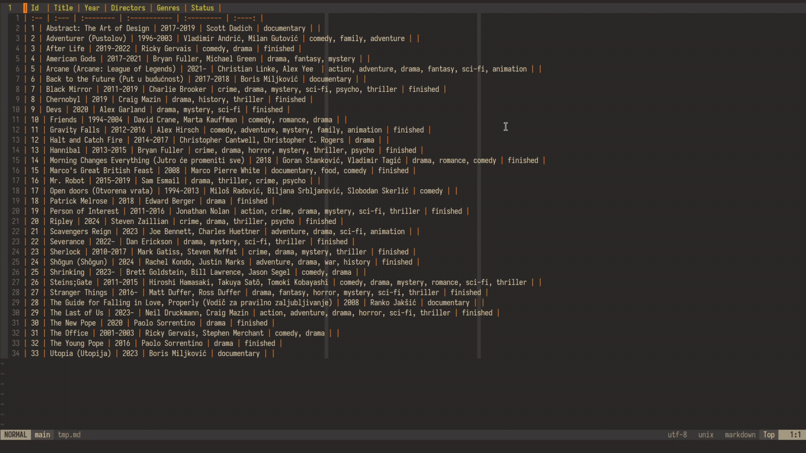

# format-md-table

## Installation

Download `format-md-table.mjs` to your system, rename it to `,format-md-table`, place it somewhere in `$PATH` (`$HOME/.local/bin` e.g.), and finally give it executable permissions with `chmod +x ,format-md-table`

## Requirements

- [nodejs](https://nodejs.org/en)

## Licence

This code is licensed under the terms of the ISC licence (see LICENCE for details).
